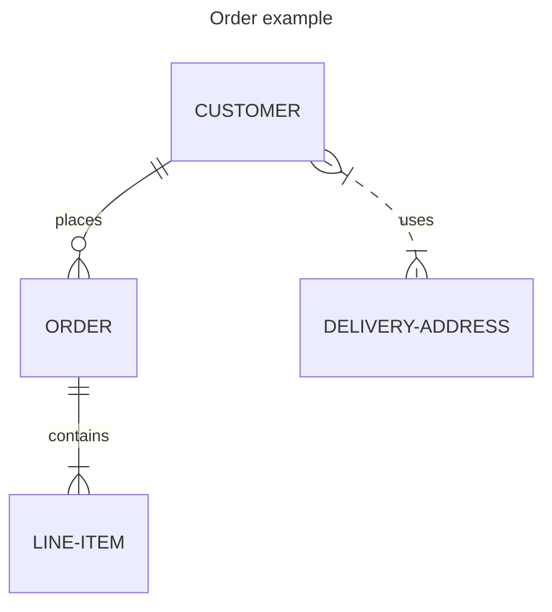
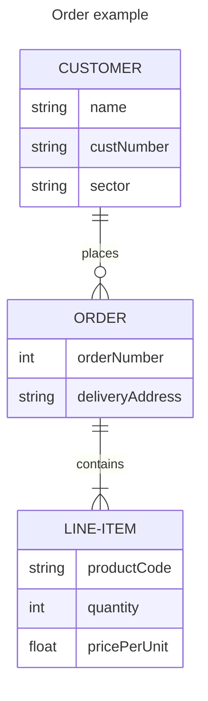

### Entity Relationship Diagram - [docs](https://mermaid.ai/open-source/syntax/entityRelationshipDiagram.html)














```mermaid
---
title: Order example
---
erDiagram
    CUSTOMER ||--o{ ORDER : places
    CUSTOMER {
        string name
        string custNumber
        string sector
    }
    ORDER ||--|{ LINE-ITEM : contains
    ORDER {
        int orderNumber
        string deliveryAddress
    }
    LINE-ITEM {
        string productCode
        int quantity
        float pricePerUnit
    }
