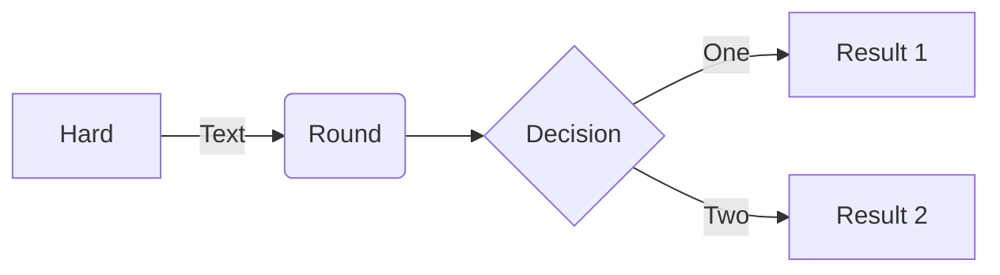

## Flowchart - [[docs](https://mermaid.ai/open-source/syntax/flowchart.html)]



```mermaid
flowchart LR

A[Hard] -->|Text| B(Round)
B --> C{Decision}
C -->|One| D[Result 1]
C -->|Two| E[Result 2]
```



```mermaid
flowchart LR
A[Hard] -->|Text| B(Round)
B --> C{Decision}
C -->|One| D[Result 1]
C -->|Two| E[Result 2]
```
