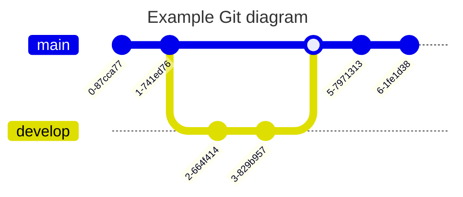
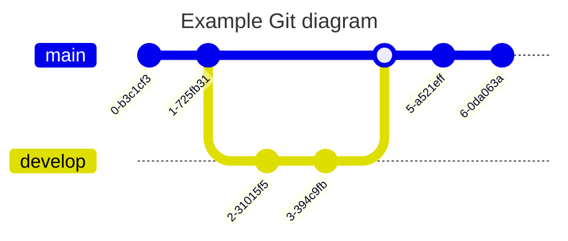
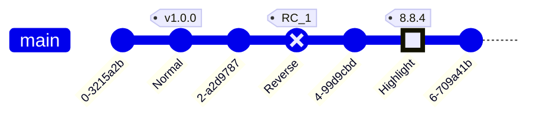
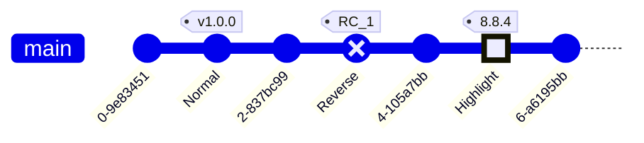

## Git Graph - [[docs](https://mermaid.ai/open-source/syntax/gitgraph.html)]



```mermaid
---
title: Example Git diagram
---
gitGraph
   commit
   commit
   branch develop
   checkout develop
   commit
   commit
   checkout main
   merge develop
   commit
   commit
```



```mermaid
---
title: Example Git diagram
---
gitGraph
   commit
   commit
   branch develop
   checkout develop
   commit
   commit
   checkout main
   merge develop
   commit
   commit
```



```mermaid
gitGraph
       commit
       commit id: "Normal" tag: "v1.0.0"
       commit
       commit id: "Reverse" type: REVERSE tag: "RC_1"
       commit
       commit id: "Highlight" type: HIGHLIGHT tag: "8.8.4"
       commit
```



```mermaid
gitGraph
       commit
       commit id: "Normal" tag: "v1.0.0"
       commit
       commit id: "Reverse" type: REVERSE tag: "RC_1"
       commit
       commit id: "Highlight" type: HIGHLIGHT tag: "8.8.4"
       commit
```
