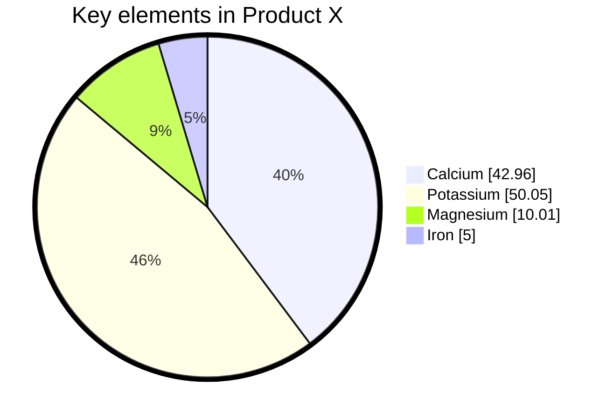

## Pie Chart - [[docs](https://mermaid.js.org/syntax/pie.html)]



```mermaid
---
config:
  pie:
    textPosition: 0.5
  themeVariables:
    pieOuterStrokeWidth: "5px"
---
pie showData
    title Key elements in Product X
    "Calcium" : 42.96
    "Potassium" : 50.05
    "Magnesium" : 10.01
    "Iron" :  5
```



```mermaid
---
config:
  pie:
    textPosition: 0.5
  themeVariables:
    pieOuterStrokeWidth: "5px"
---
pie showData
    title Key elements in Product X
    "Calcium" : 42.96
    "Potassium" : 50.05
    "Magnesium" : 10.01
    "Iron" :  5
```
