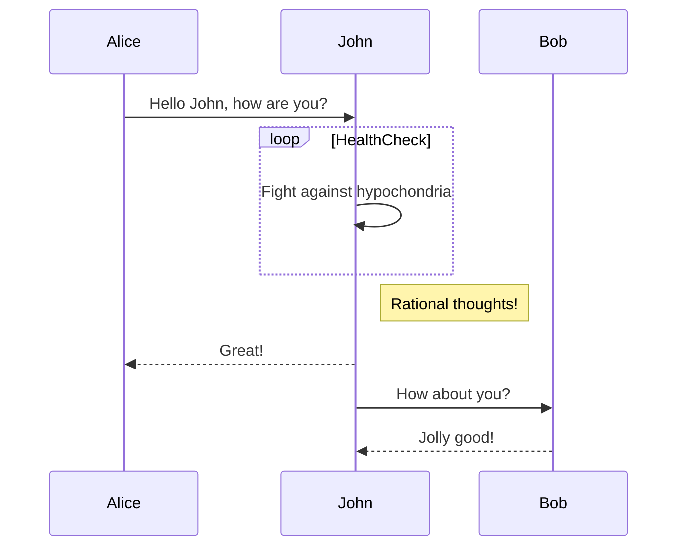

## Sequence diagram - [[docs](https://mermaid.ai/open-source/syntax/sequenceDiagram.html)]



```mermaid
sequenceDiagram
Alice->>John: Hello John, how are you?
loop HealthCheck
    John->>John: Fight against hypochondria
end
Note right of John: Rational thoughts!
John-->>Alice: Great!
John->>Bob: How about you?
Bob-->>John: Jolly good!
```



```mermaid
sequenceDiagram
Alice->>John: Hello John, how are you?
loop HealthCheck
    John->>John: Fight against hypochondria
end
Note right of John: Rational thoughts!
John-->>Alice: Great!
John->>Bob: How about you?
Bob-->>John: Jolly good!
```
