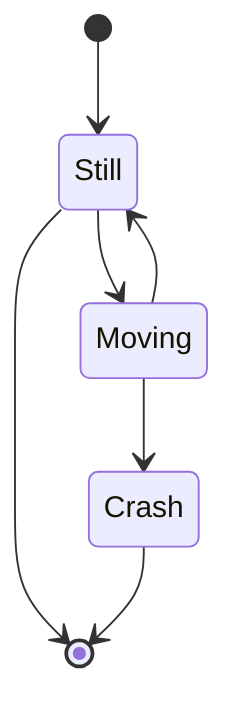
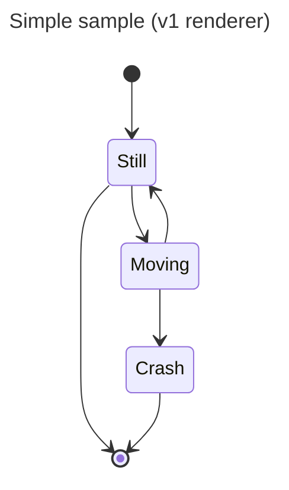

### State Diagram - [docs](https://mermaid.js.org/open-source/syntax/stateDiagram.html)



```mermaid
---
title: Simple sample (v2 renderer)
---
stateDiagram-v2
    [*] --> Still
    Still --> [*]

    Still --> Moving
    Moving --> Still
    Moving --> Crash
    Crash --> [*]
```



---
title: Simple sample (v2 renderer)
---

```mermaid
stateDiagram-v2
    [*] --> Still
    Still --> [*]

    Still --> Moving
    Moving --> Still
    Moving --> Crash
    Crash --> [*]
```

---



```mermaid
---
title: Simple sample (v1 renderer)
---
stateDiagram
    [*] --> Still
    Still --> [*]

    Still --> Moving
    Moving --> Still
    Moving --> Crash
    Crash --> [*]
```



---
title: Simple sample (v1 renderer)
---

```mermaid
stateDiagram
    [*] --> Still
    Still --> [*]

    Still --> Moving
    Moving --> Still
    Moving --> Crash
    Crash --> [*]
```
