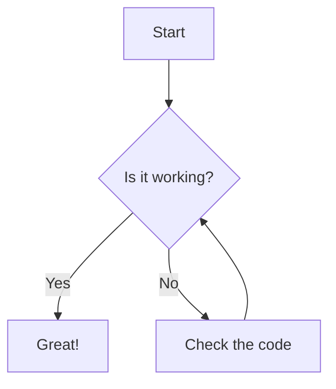
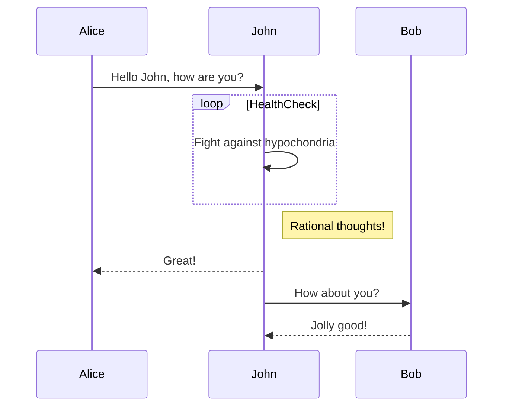
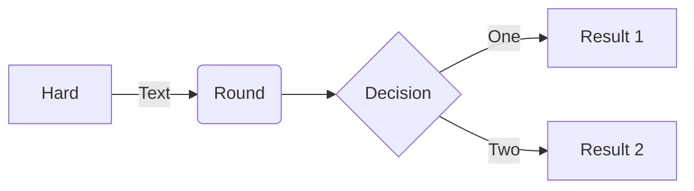
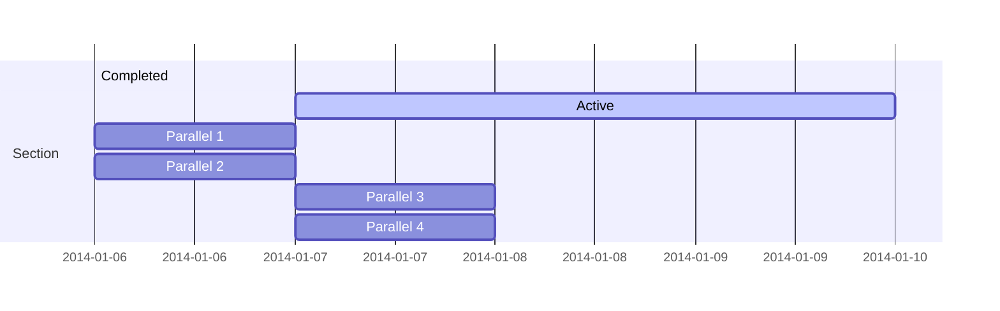

[Mermaid](https://mermaid.ai/open-source/intro/) is a JavaScript-based diagramming and charting tool that allows you to create diagrams using a simple markdown-like syntax. It supports various types of diagrams, including flowcharts, sequence diagrams, class diagrams, state diagrams, and more.

To use Mermaid in Dr. Jekyll, you can include your Mermaid code within a code block and specify `mermaid` as the language:

## Example Mermaid Diagram

### Graph





### Sequence diagram - [[docs](https://mermaid.js.org/syntax/sequenceDiagram.html)]





### Flowchart - [[docs](https://mermaid.js.org/syntax/flowchart.html)]





### Gantt chart - [[docs](https://mermaid.js.org/syntax/gantt.html)]





