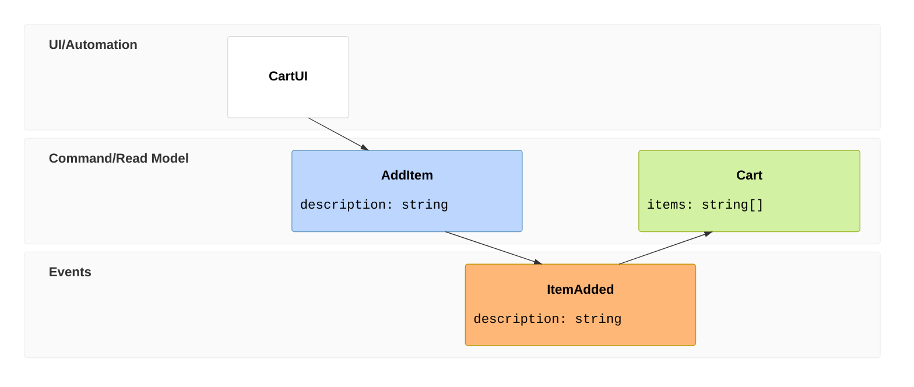

<!-- markdownlint-disable-next-line MD025 MD022 -->
# [Event Modeling](https://mermaid.ai/open-source/syntax/eventModeling.html)



```mermaid
eventmodeling

timeframe 01 ui CartUI
timeframe 02 command AddItem { description: string }
timeframe 03 event ItemAdded { description: string }
timeframe 04 readmodel Cart { items: string[] }
```



```mermaid
eventmodeling

timeframe 01 ui CartUI
timeframe 02 command AddItem { description: string }
timeframe 03 event ItemAdded { description: string }
timeframe 04 readmodel Cart { items: string[] }
```
