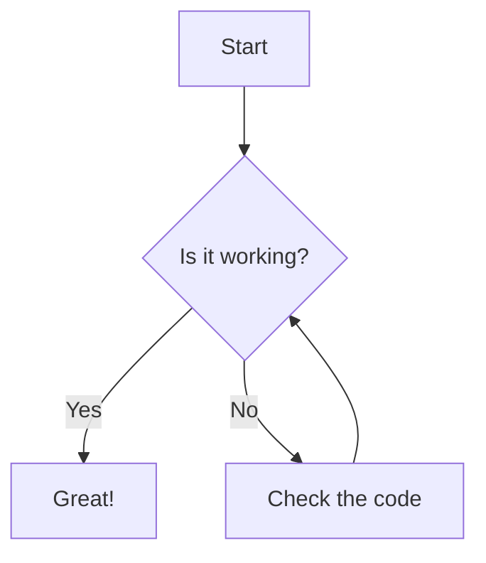

<!-- markdownlint-disable-next-line MD025 MD022 -->
# [Graph](https://mermaid.ai/open-source/syntax/graph.html)



```mermaid
graph TD
    A[Start] --> B{Is it working?}
    B -- Yes --> C[Great!]
    B -- No --> D[Check the code]
    D --> B
```



```mermaid
graph TD
    A[Start] --> B{Is it working?}
    B -- Yes --> C[Great!]
    B -- No --> D[Check the code]
    D --> B
```
