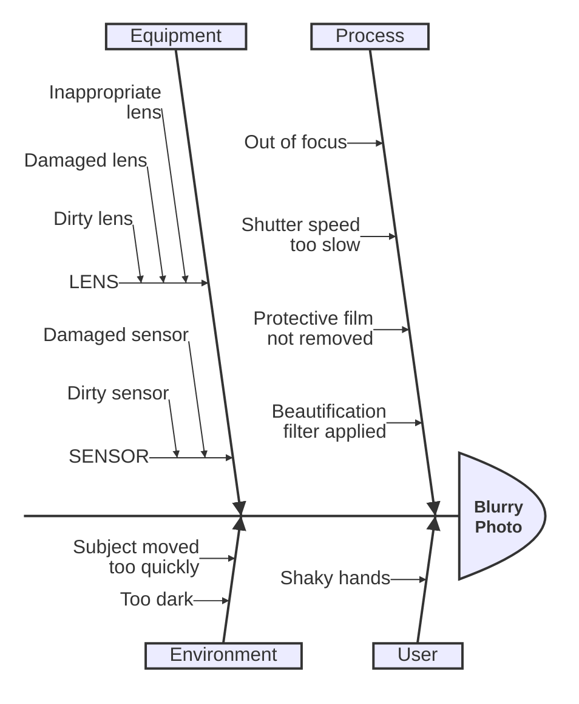

# [Ishikawa](https://mermaid.ai/open-source/syntax/ishikawa.html) --- IGNORE ---

{: .warning }
This is a new diagram type in Mermaid. Its syntax may evolve in future versions.



```mermaid
ishikawa-beta
    Blurry Photo
    Process
        Out of focus
        Shutter speed too slow
        Protective film not removed
        Beautification filter applied
    User
        Shaky hands
    Equipment
        LENS
            Inappropriate lens
            Damaged lens
            Dirty lens
        SENSOR
            Damaged sensor
            Dirty sensor
    Environment
        Subject moved too quickly
        Too dark

```



```mermaid
ishikawa-beta
    Blurry Photo
    Process
        Out of focus
        Shutter speed too slow
        Protective film not removed
        Beautification filter applied
    User
        Shaky hands
    Equipment
        LENS
            Inappropriate lens
            Damaged lens
            Dirty lens
        SENSOR
            Damaged sensor
            Dirty sensor
    Environment
        Subject moved too quickly
        Too dark
```
