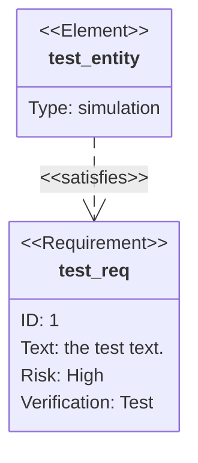

<!-- markdownlint-disable-next-line MD025 MD022 -->
# [Requirement Diagram](https://mermaid.ai/open-source/syntax/requirementDiagram.html)



```mermaid
    requirementDiagram

    requirement test_req {
    id: 1
    text: the test text.
    risk: high
    verifymethod: test
    }

    element test_entity {
    type: simulation
    }

    test_entity - satisfies -> test_req
```



```mermaid
    requirementDiagram

    requirement test_req {
    id: 1
    text: the test text.
    risk: high
    verifymethod: test
    }

    element test_entity {
    type: simulation
    }

    test_entity - satisfies -> test_req
```
