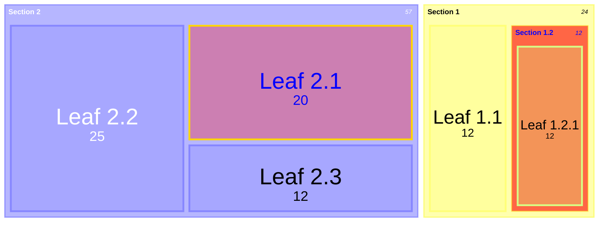

<!-- markdownlint-disable-next-line MD025 MD022 -->
# [Tree Map](https://mermaid.ai/open-source/syntax/treemap.html)



```mermaid
treemap-beta
"Section 1"
    "Leaf 1.1": 12
    "Section 1.2":::class1
      "Leaf 1.2.1": 12
"Section 2"
    "Leaf 2.1": 20:::class1
    "Leaf 2.2": 25
    "Leaf 2.3": 12

classDef class1 fill:red,color:blue,stroke:#FFD600;
```



```mermaid
treemap-beta
"Section 1"
    "Leaf 1.1": 12
    "Section 1.2":::class1
      "Leaf 1.2.1": 12
"Section 2"
    "Leaf 2.1": 20:::class1
    "Leaf 2.2": 25
    "Leaf 2.3": 12

classDef class1 fill:red,color:blue,stroke:#FFD600;
```
