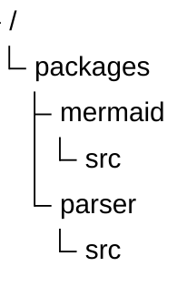
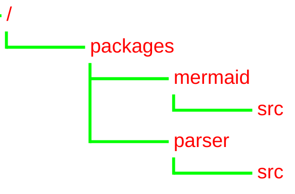

<!-- markdownlint-disable-next-line MD025 MD022 -->
# [TreeView](https://mermaid.ai/open-source/syntax/treeView.html)



```mermaid
treeView-beta
    "packages"
        "mermaid"
            "src"
        "parser"
            "src"
```



```mermaid
treeView-beta
    "packages"
        "mermaid"
            "src"
        "parser"
            "src"
```

---



```mermaid
---
config:
    treeView:
        rowIndent: 80
        lineThickness: 3
    themeVariables:
        treeView:
            labelFontSize: '20px'
            labelColor: '#FF0000'
            lineColor: '#00FF00'
---
treeView-beta
    "packages"
        "mermaid"
            "src"
        "parser"
            "src"
```



```mermaid
---
config:
    treeView:
        rowIndent: 80
        lineThickness: 3
    themeVariables:
        treeView:
            labelFontSize: '20px'
            labelColor: '#FF0000'
            lineColor: '#00FF00'
---
treeView-beta
    "packages"
        "mermaid"
            "src"
        "parser"
            "src"
```
