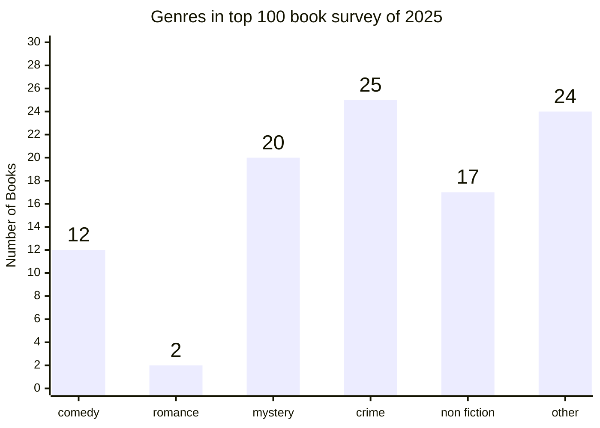

<!-- markdownlint-disable-next-line MD025 MD022 -->
# [XY Chart](https://mermaid.ai/open-source/syntax/xyChart.html)



```mermaid
---
config:
  themeVariables:
    xyChart:
      plotColorPalette: '#000000, #0000FF, #00FF00, #FF0000'
---
xychart
title "Different Colors in xyChart"
x-axis "categoriesX" ["Category 1", "Category 2", "Category 3", "Category 4"]
y-axis "valuesY" 0 --> 50
%% Black line
line [10,20,30,40]
%% Blue bar
bar [20,30,25,35]
%% Green bar
bar [15,25,20,30]
%% Red line
line [5,15,25,35]
```



```mermaid
---
config:
  themeVariables:
    xyChart:
      plotColorPalette: '#000000, #0000FF, #00FF00, #FF0000'
---
xychart
title "Different Colors in xyChart"
x-axis "categoriesX" ["Category 1", "Category 2", "Category 3", "Category 4"]
y-axis "valuesY" 0 --> 50
%% Black line
line [10,20,30,40]
%% Blue bar
bar [20,30,25,35]
%% Green bar
bar [15,25,20,30]
%% Red line
line [5,15,25,35]
```

---



```mermaid
---
config:
    xyChart:
        showDataLabel: true
        showDataLabelOutsideBar: true
---
xychart
    title "Genres in top 100 book survey of 2025"
    x-axis [comedy, romance, mystery, crime, "non fiction", other]
    y-axis "Number of Books" 0 --> 30
    bar [12,2,20,25,17,24]
```



```mermaid
---
config:
    xyChart:
        showDataLabel: true
        showDataLabelOutsideBar: true
---
xychart
    title "Genres in top 100 book survey of 2025"
    x-axis [comedy, romance, mystery, crime, "non fiction", other]
    y-axis "Number of Books" 0 --> 30
    bar [12,2,20,25,17,24]
```
