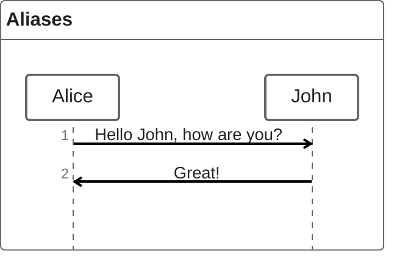

<!-- markdownlint-disable-next-line MD025 MD022 -->
# [ZenUML](https://mermaid.ai/open-source/syntax/zenuml.html)



```mermaid
zenuml
    title Aliases
    A as Alice
    J as John
    A->J: Hello John, how are you?
    J->A: Great!
```



```mermaid
zenuml
    title Aliases
    A as Alice
    J as John
    A->J: Hello John, how are you?
    J->A: Great!
```
